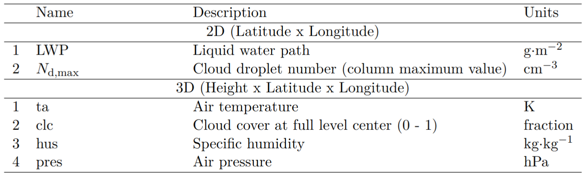
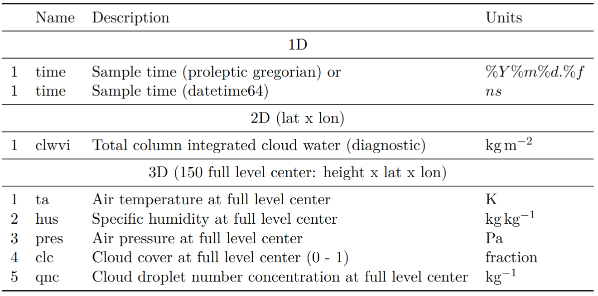
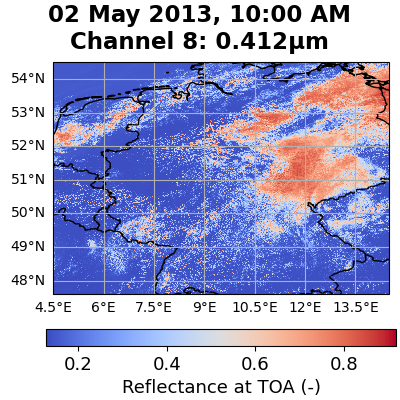
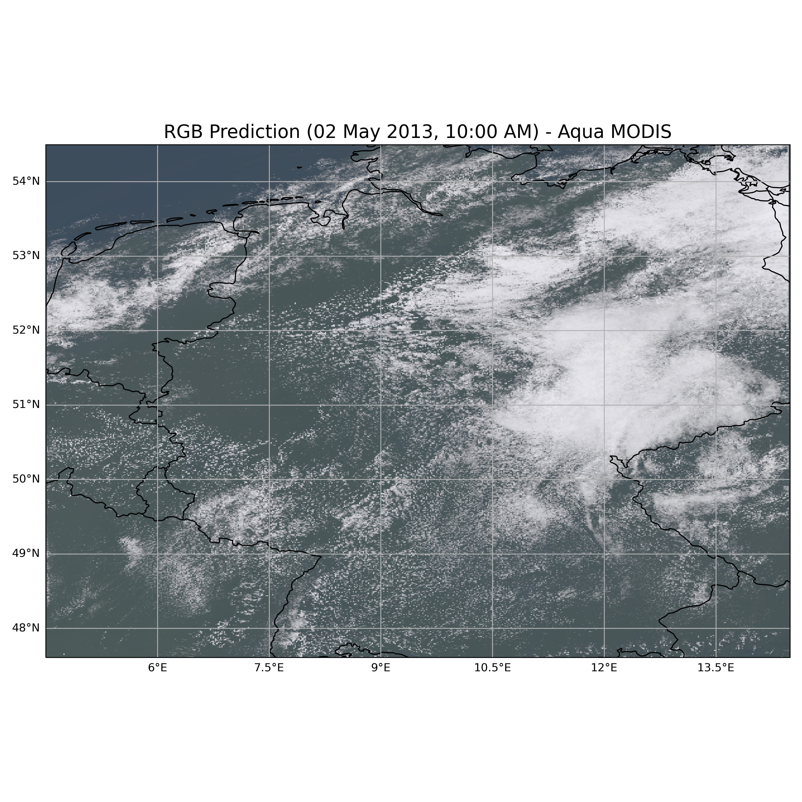
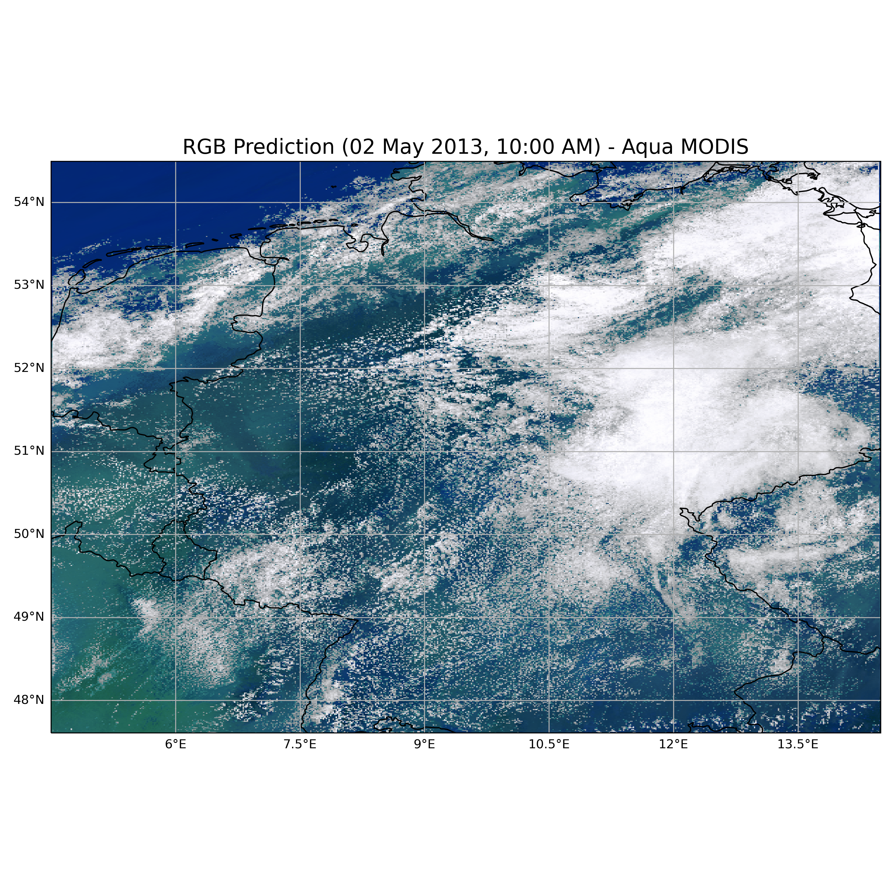

### 1. Installation
1. Clone the repository using the following command:
```bash
   git clone https://github.com/jesseniagonzalezv/Emulation-of-Forward-Modeled-Top-of-Atmosphere-MODIS-Based-Spectral-Channels-Using-Machine-Learning.git
```
   
### 2. Running All Code

To obtain the necessary files for the emulator, begin by navigating to the project's root directory `(Emulation-of-Forward-Modeled-Top-of-Atmosphere-MODIS-Based-Spectral-Channels-Using-Machine-Learning)`, and then proceed to the `scripts/get_predictions.sh`. This script is organized into two primary steps:

1. **Step 1: Preparation of the NetCDF** - This step prepares the NetCDF file containing the variables needed for the emulator.
2. **Step 2: Calculation and Visualization** - It calculates the predictions of the 36 spectral channels (Reflectances: 1-19, 26 channel and Radiances 20-25, 27-36), saves them into another NetCDF file, and generates corresponding plots in PNG format, including true color.

To execute these steps, update the input data paths and results folder paths to suit your local environment settings and then run the script. Each step is detailed further in sections 2.1 and 2.2 below:
   
```bash
   # Command to run the script
   cd Emulation-of-Forward-Modeled-Top-of-Atmosphere-MODIS-Based-Spectral-Channels-Using-Machine-Learning/scripts
   bash get_predictions.sh
```


#### 2.1. Preparing the Data
#### Variables need
The variables needed to run the emulator are shown in the next table:
<figure>
  <figcaption>Overview of the thermodynamic variables used for the ML models based on ICON-LES data. </figcaption>
  
</figure>

#### Creating LWP and Ndmax:

To create the LWP and Nd_max variables, the following thermodynamic variables from the ICON-LES simulation are utilized. 
These variables are essential for configuring the emulator:

<figure>
  <figcaption>Diagram illustrating the thermodynamic variables used from the ICON-LES simulation to create the required variables for the emulator.</figcaption>
  
</figure>

To generate the file with the appropriate variables for the emulator run the next commands (Step 1 of script/get_prediction.sh):

```bash
    # Set the output directory for the results
    results_output_path="folder_path_to_save_the_results"
    
    # Define the base path for the netCDF files
    base_path="path_to_netCDF"
    # Define the base path for the netCDF files
    name_file="icon_germany_20130502_T10.nc"

    # Specify the full path to the netCDF files
    path_icon_netCDF=$base_path/$name_file  
    
    # If the variable names in your files differ from the expected names, list them here.
    # Replace the placeholders with the actual names used in your files.
    names_variables="temp qv pres qnc clc tqc_dia"  # Example custom names
    # names_variables="ta hus pres qnc clc clwvi"  # Default expected names
    
    # Execute the Python script to create variables for the emulator 
    # path when current working directory is /Emulation-of-Forward-Modeled-Top-of-Atmosphere-MODIS-Based-Spectral-Channels-Using-Machine-Learning/script
    # This command includes redirection of all output to a log file for easy troubleshooting
    python ../src/create_variables_emulator.py --path_icon_netCDF $path_icon_netCDF \
                                               --names_variables $names_variables \
                                               --results_output_path $results_output_path \
                                               &> $results_output_path/log_creation_variables_emulator.txt  
    
    # Log file containing detailed output information
    echo " ---- Check log in $results_output_path/log_creation_variables_emulator.txt for details ----"
 ```
    

```
This code will generate a new file with the format of:
  $results_output_path/"${name_base}_lwp_Ndmax.nc" ("$results_output_path/icon_germany_20130502_T10_lwp_Ndmax.nc")
  # name base is define as the $name_file without the ".nc" extension and we add the new suffix "_lwp_Ndmax.nc"
  name_base="${name_file%.nc}"
```

#### 2.2. Obtaining the spectral channels predictions and plots (It is not needed modify only if you want to run this step it is needed to modify the path_icon_emulator_netCDF,  results_output_path)
To generate the spectral channel predictions and plots run the following command (Step 2 of script/get_prediction.sh):
This will generate predictions for the 36 spectral channels, save the results to a NetCDF file, and plot both the spectral data and the true color.

```bash
    # Set the output directory where the results will be stored
    results_output_path="folder_path_to_save_the_results"
    
    # Specify the directory containing the PCA, scaler, and model files
    # Adjust this path according to your project's folder structure 
    # the name of the models in the file need to be provide as a string in the variable name_file_model (name_file_model="NN_model")
    path_pca_scaler_model="../models" # Example path when current working directory is /Emulation-of-Forward-Modeled-Top-of-Atmosphere-MODIS-Based-Spectral-Channels-Using-Machine-Learning/script
    
    # Provide the path to the input NetCDF file to be used for predictions
    # Adjust the filename as needed to match your specific data
    path_icon_emulator_netCDF="$results_output_path/icon_germany_20130502_T10_lwp_Ndmax.nc"
    
    # Choose the method for RGB visualization (either "inverse_gamma" or "histogram")
    method_rgb="inverse_gamma"
    
    # Set the gamma value for gamma correction
    gamma_value=2.2
    
    # Execute the prediction script with the provided paths and parameters
    # path when current working directory is /Emulation-of-Forward-Modeled-Top-of-Atmosphere-MODIS-Based-Spectral-Channels-Using-Machine-Learning/script
    python ../src/get_prediction.py --path_pca_scaler_model $path_pca_scaler_model \
                                    --path_icon_netCDF $path_icon_emulator_netCDF \
                                    --results_output_path $results_output_path \
                                    --name_file_model $name_file_model \
                                    --method_rgb $method_rgb \
                                    --gamma_value $gamma_value \
                                    &> $results_output_path/log_get_prediction_and_rgb_plot_all_channel.txt  
    # Log file containing detailed output information
    echo " ---- Check the log in $results_output_path/log_get_prediction_and_rgb_plot_all_channel.txt ----"
```

### 3. Plotting Results

#### Spectral plots
<figure>
  <figcaption>Below is an example of a spectral channel predicted</figcaption>
  
 
</figure>


#### True Color
<table>
  <tr>
    <td>
        <figure>
        <figcaption>Example RGB Plot (using contrast enhancement inverse gamma) </figcaption>
        
        </figure>
</td>
    <td>
        <figure>
        <figcaption>Example RGB Plot (using contrast enhancement histogram) </figcaption>
        
         </figure>
    </td>
  </tr>
</table>


### 4. Notebooks
For additional demonstrations, check out the following Jupyter notebooks:

- [Demonstration Notebook](notebooks/predict_channels_rgb.ipynb)
